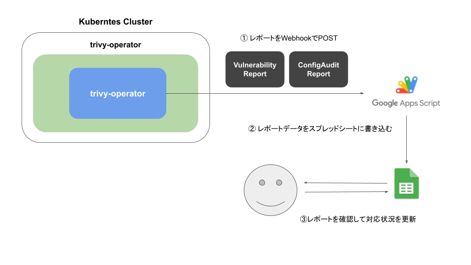

# TrivyReportManager_PoC

Google Apps Script to receive Trivy Operator reports by Webhook and manage vulnerabilities in a SpreadSheet




## Installation

### Google Apps Script
1. Install [Google Apps Script GitHub Assistant](https://chrome.google.com/webstore/detail/google-apps-script-github/lfjcgcmkmjjlieihflfhjopckgpelofo) and link to GitHub.
1. Create a new Google Spreadsheet.
1. Open a new Apps Script project from the sheet.
1. Pull [this repository](https://github.com/kairi003/TrivyReportManager_PoC) on the project by the GAS Assistant.
1. Deploy as Web App and copy the URL($GAS_URL).

### Trivy Operator (with Helm)
1. Add Aqua chart repository
    ```
    helm repo add aqua https://aquasecurity.github.io/helm-charts/
    helm repo update
    ```
1. Install the chart from the Aqua chart repository
    ```
    helm install trivy-operator aqua/trivy-operator \
        --namespace trivy-system \
        --create-namespace \
        --set="operator.webhookBroadcastURL=$GAS_URL" \
        --set="additionalVulnerabilityReportFields=Description,Links,CVSS,Target"
        --version 0.3.0
    ```
